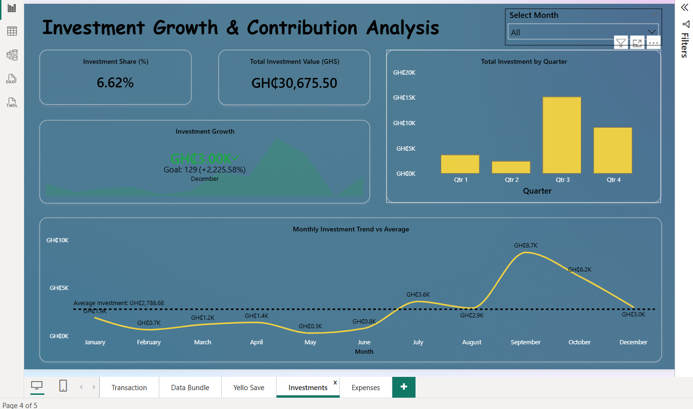
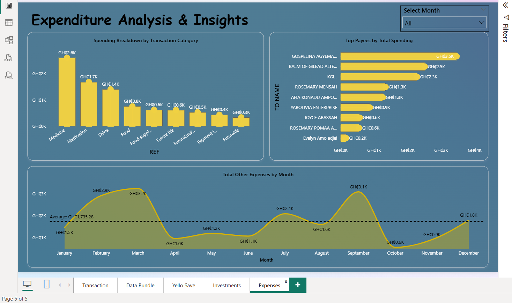

# 📊 MoMo Financial Analysis Dashboard

**Turning personal mobile money transactions into actionable financial insights**

---

## 📌 Overview

This project presents a comprehensive **Power BI dashboard** analyzing personal Mobile Money (MoMo) transactions for the year **2025**.

The dashboard transforms raw transactional data into meaningful insights across:

- Transaction activity and trends  
- Spending patterns and expense behavior  
- Savings discipline (Yello Save)  
- Investment growth and contributions  
- Overall financial health  

The objective is to understand **how money flows, how it is allocated, and how financial discipline evolves over time**.

---

## 🧠 Business Questions

This analysis was guided by key questions:

### 💳 Transactions
- What is the total transaction volume and value?
- When are transactions most active (AM vs PM)?
- How do transactions trend over time?

### 📶 Data Bundle
- How much is spent on data bundles?
- How frequently are bundles purchased?
- How did pricing changes affect spending?

### 💰 Savings (Yello Save)
- How consistent is saving behavior?
- What is the total amount saved?
- How did savings evolve over time?

### 📈 Investments
- How much is invested?
- What share of expenses goes into investments?
- How do investments grow month-over-month?

### 💸 Expenses
- What are the major spending categories?
- Who are the top recipients?
- Why are certain expenses higher?

### 🧾 Financial Health
- Is the net financial position improving?
- How is income distributed across spending, savings, and investments?
- Is a negative balance due to overspending or strategy?

---

## 📊 Dashboard Pages

---

### 1️⃣ Transaction Overview

- Total transactions and value  
- AM vs PM activity  
- Weekly transaction patterns  
- Monthly trends  


---

### 2️⃣ Data Bundle Spending & Usage Analysis

- Total data bundle spending  
- Purchase frequency  
- Quarterly distribution  
- Average bundle cost  

📌 **Insight:**  
Data bundle spending increased in the second half of the year due to a pricing change from **GHS 350 (90GB)** to **GHS 399 (214GB)**.


---

### 3️⃣ Yello Save Savings & Consistency Analysis

- Total savings: **GHS 15,388+**  
- Savings consistency: **98% (359 days)**  
- Average daily savings  

📌 **Key Insight:**  
Savings increased significantly after **June 2025**, when daily savings changed from **GHS 32 → GHS 52**.

📌 **Behavior Insight:**  
Automated savings ensured strong financial discipline and consistency.


---

### 4️⃣ Investment Growth & Contribution Analysis

- Total investment value  
- Investment share (%)  
- Monthly growth trend  
- Quarterly distribution  

📌 **Insight:**  
Investment contributions increased in later months, indicating a shift toward long-term financial planning.



---

### 5️⃣ Expense Analysis & Spending Patterns

- Spending by category  
- Top payees  
- Monthly expense trends  

📌 **Context:**  
Higher expenses on medication and healthcare were observed due to health challenges during the year.

👉 This explains increased spending in medical-related categories.



---

### 6️⃣ Financial Health Summary

- Net Financial Position  
- Total Income vs Expenses  
- Savings Rate  
- Monthly financial allocation  

📌 **Key Insight:**  
The negative net position reflects **active cash movement**, not overspending.

👉 Funds are frequently:
- Transferred to bank accounts  
- Invested  

📌 **Conclusion:**  
This indicates **intentional financial management and disciplined money allocation**.


---

## 📈 Key Insights

- Strong savings discipline with **98% consistency (359 days)**
- Increase in savings after mid-year adjustment (GHS 32 → GHS 52)
- Growing investment contributions toward year-end
- High medical expenses driven by real-life health conditions
- Financial behavior reflects **strategic cash management**, not overspending

---

## 🧰 Tools & Technologies

- **Power BI** – Dashboard design  
- **DAX** – Calculations and KPIs  
- **Power Query** – Data transformation  
- **Excel** – Data preparation  

---


## 🧮 DAX Measures

<details>
<summary>Click to view all DAX measures</summary>

```DAX
-- ========================
-- INCOME
-- ========================
Total Income =
CALCULATE(
    SUM('MoMo_Transactions'[AMOUNT]),
    'MoMo_Transactions'[TRANS. TYPE] <> "DEBIT"
)

-- ========================
-- EXPENSES
-- ========================
Total Expenses =
CALCULATE(
    SUM('MoMo_Transactions'[AMOUNT]),
    'MoMo_Transactions'[TRANS. TYPE] = "DEBIT"
)

Total Other Expenses =
CALCULATE(
    SUM('MoMo_Transactions'[AMOUNT]),
    'MoMo_Transactions'[TRANS. TYPE] = "DEBIT",
    NOT 'MoMo_Transactions'[OVA] IN {
        "yelloAD.sp",
        "ICS3.sp",
        "HubtelPos",
        "zpcot.sp"
    }
)

-- ========================
-- TRANSACTIONS
-- ========================
Total Transactions =
COUNT('MoMo_Transactions'[F_ID])

Total Debit Transactions =
CALCULATE(
    COUNT('MoMo_Transactions'[F_ID]),
    'MoMo_Transactions'[TRANS. TYPE] = "DEBIT"
)

Total Credit Transaction Amount =
CALCULATE(
    SUM('MoMo_Transactions'[AMOUNT]),
    'MoMo_Transactions'[TRANS. TYPE] <> "DEBIT"
)

-- ========================
-- DATA BUNDLE
-- ========================
Total Data Bundle Spending =
CALCULATE(
    SUM('MoMo_Transactions'[AMOUNT]),
    'MoMo_Transactions'[AMOUNT] IN {350, 399},
    'MoMo_Transactions'[TRANS. TYPE] = "DEBIT"
)

Total Data Bundle Transactions =
CALCULATE(
    COUNTROWS('MoMo_Transactions'),
    'MoMo_Transactions'[AMOUNT] IN {350, 399},
    'MoMo_Transactions'[TRANS. TYPE] = "DEBIT"
)

Average Bundle Cost =
DIVIDE(
    [Total Data Bundle Spending],
    [Total Data Bundle Transactions]
)

-- ========================
-- SAVINGS (YELLO SAVE)
-- ========================
Total Yello Save Savings =
CALCULATE(
    SUM('MoMo_Transactions'[AMOUNT]),
    'MoMo_Transactions'[AMOUNT] IN {32, 52},
    'MoMo_Transactions'[TRANS. TYPE] = "DEBIT"
)

Total Yello Save Transactions =
CALCULATE(
    COUNTROWS('MoMo_Transactions'),
    'MoMo_Transactions'[AMOUNT] IN {32, 52},
    'MoMo_Transactions'[TRANS. TYPE] = "DEBIT"
)

Average Daily Savings =
DIVIDE(
    [Total Yello Save Savings],
    [Total Yello Save Transactions]
)

Savings Consistency % =
DIVIDE(
    [Total Yello Save Transactions],
    365
)

-- ========================
-- INVESTMENTS
-- ========================
Total Investment =
CALCULATE(
    SUM('MoMo_Transactions'[AMOUNT]),
    'MoMo_Transactions'[OVA] IN {"ICS3.sp","HubtelPos","zpcot.sp"},
    'MoMo_Transactions'[TRANS. TYPE] = "DEBIT"
)

%Investment =
DIVIDE(
    [Total Investment],
    [Total Expenses]
)

-- ========================
-- FINANCIAL HEALTH
-- ========================
Net Financial Position =
[Total Income] - [Total Expenses]

Savings Rate =
DIVIDE(
    [Total Yello Save Savings],
    [Total Income]
)
## 📈 Key Insights & Interpretation

This analysis reveals a structured approach to personal financial management rather than irregular or uncontrolled spending.

- **High savings consistency (98%)** demonstrates disciplined financial behavior supported by automated saving.
- A **mid-year increase in savings contribution (GHS 32 → GHS 52)** reflects improved financial capacity and commitment.
- **Investment activity increases in later months**, indicating a shift from short-term spending to long-term wealth building.
- Elevated spending on healthcare is **context-driven**, linked to real-life medical needs rather than discretionary overspending.
- A **negative or low MoMo balance is not indicative of poor financial health**, but rather a result of frequent fund transfers to bank accounts and investment platforms.

👉 Overall, the data reflects **intentional financial planning, disciplined saving, and strategic allocation of funds**.

---

## 💡 Key Recommendations

Based on the analysis, the following recommendations can further improve financial efficiency and decision-making:

### 1. Track Cross-Platform Cash Flow
Since funds are frequently transferred out of MoMo to bank accounts and investments, integrating **multi-account tracking** would provide a more complete financial picture.

---

### 2. Maintain and Optimize Automated Savings
The introduction of automated savings significantly improved consistency.

👉 Recommendation:
- Continue automation  
- Periodically review and increase savings based on income growth  

---

### 3. Strengthen Investment Strategy
Investment contributions increased over time, which is a positive signal.

👉 Recommendation:
- Introduce **diversification tracking**
- Monitor returns to evaluate investment performance  

---

### 4. Monitor Health-Related Expenses
Medical expenses contributed significantly to overall spending.

👉 Recommendation:
- Consider **budget allocation for healthcare**
- Explore insurance or preventive healthcare options  

---

### 5. Improve Financial Visibility
The current MoMo balance alone does not reflect true financial position.

👉 Recommendation:
- Build a **unified financial dashboard** combining:
  - MoMo  
  - Bank accounts  
  - Investments  

---

### 6. Introduce Budget Benchmarks
Adding spending benchmarks can help control variability in expenses.

👉 Recommendation:
- Set monthly limits for key categories  
- Track deviations against planned budgets  

---

## 🚀 Project Value

This project demonstrates:

- Ability to **transform raw transactional data into insights**
- Strong understanding of **financial behavior analysis**
- Practical use of **Power BI, DAX, and data modeling**
- Real-world application of **data storytelling and decision support**

👉 The dashboard goes beyond visualization by providing **context, interpretation, and actionable recommendations**.

---

## 🎯 Conclusion

This analysis highlights a financially disciplined approach characterized by:

- Consistent saving habits  
- Increasing investment contributions  
- Strategic cash movement across platforms  

Despite fluctuations in wallet balance, the overall financial behavior reflects **intentional planning, resilience, and long-term wealth focus**.
